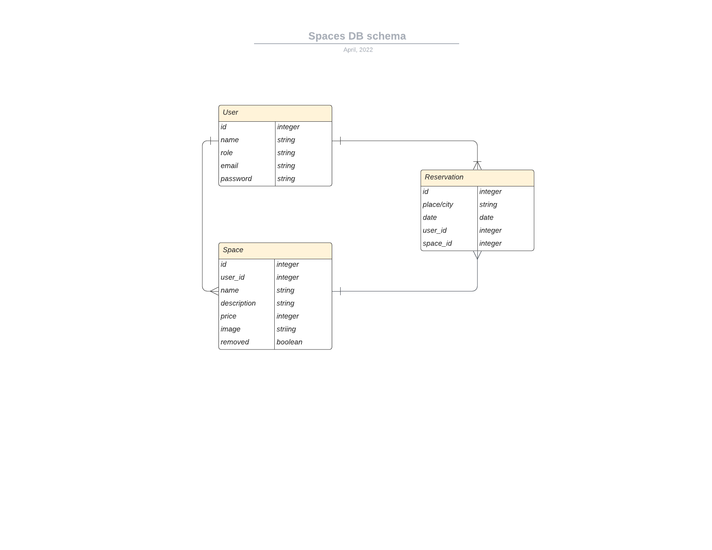

# ROR: Spaces-api

> ROR api app purly designed to act as backend and to integrate with [Spaces](https://github.com/Hope1226/book-appointment-front-end).

## Schema


## Built With

- Major languages: Ruby
- Frameworks: Ruby on Rails
- Gems / Libraries: Devise, Devise-JWT

## Getting Started

To get a local copy up and running follow these simple example steps.

### Prerequisites

You need to have followings installed in your local machine:
- `Ruby`
- `Postgresql`
- `Rails`
- `RSpec`
- `node.js`
- `Postman`

### Setup

To setup the spaces-api project in your local machine, in the repo page: 
- click on code (dropdown list) > Download as ZIP. 
- or open terminal of path you want to install project and run this command:
- `git clone git@github.com:Hope1226/book-appointment-back-end.git`

### Setup: Rails
- `cd book-appointment-back-end/`
- `bundle install`
- `bin/rails db:create`
- `bin/rails db:migrate`

## Instruction on the usage
- Run the following comands in your command line:
- `rails s`
- Run Postman locally
- Make sure the request type is `POST`
- Insert the follwoing into the URL: `http://127.0.0.1:3000/signup`
- In the body of the request enter the credentials in the following format and push the button send:
```JSON
{
  "user": {
        "name": "user name",
        "email": "user@gmail.com",
        "password": "userPassword",
        "password_confirmation": "userPassword"
    }
}
```
- If you see the response in a following format, congratulation your sign up was successful:
```JSON
{
    "status": 200,
    "message": "Signed up sucessfully.",
    "data": {
        "id": 11,
        "name": "user name",
        "role": "user",
        "created_at": "2022-04-06T09:59:53.819Z",
        "updated_at": "2022-04-06T09:59:53.819Z",
        "email": "user@gmail.com",
        "jti": "7d84e93d-cf7e-4c9b-9582-1029388cd4f2"
    }
}
```
- Along with the above response, the app returns `Authorization token` in the headers, please make sure you make a copy of that.
- Please note, for the consecutive requests to get `spaces` and manage `reservations` you need to send the above mentioned `token` in the headers of your requests.

## Tests
- To run tests for current app, please run below commands in your terminal:
- `n/a`

## Authors

👤 **Umidjon Ustabaev**

- GitHub: [@Hope1226](https://github.com/Hope1226)
- LinkedIn: [LinkedIn](https://www.linkedin.com/in/umidjon-ustabaev/)

👤 **KARANGWA Ntwali Josue**

- GitHub: [Ntwali-Josue](https://github.com/Ntwali-Josue)
- Twitter: [Ntwali-Josue](https://twitter.com/JosueNtwali)
- LinkedIn: [Ntwali-Josue](https://linkedin.com/in/karangwa)

👤 **Rafael Echart**

- GitHub: [@RafaelEchart](https://github.com/rafaelechart)
- Twitter: [@RafaelEchart](https://twitter.com/rafaelechart)

👤 **Zain Sadaqat**

- GitHub: [@zainsadaqat ](https://github.com/zainsadaqat)
- Twitter: [@zain_sadaqat](https://twitter.com/zain_sadaqat)

## Project Management
- The workflow of this project is managed by [Final group capstone: Book an Appointment](https://github.com/users/Hope1226/projects/1).

## 🤝 Contributing

Contributions, issues, and feature requests are welcome!

Feel free to check the [issues page](https://github.com/Hope1226/book-appointment-back-end/issues).

## Show your support

Give a ⭐️ if you like this project!

## Acknowledgments

- Hat tip to anyone whose code was used
- Inspiration
- etc

## 📝 License

This project is [MIT](./MIT.md) licensed.
